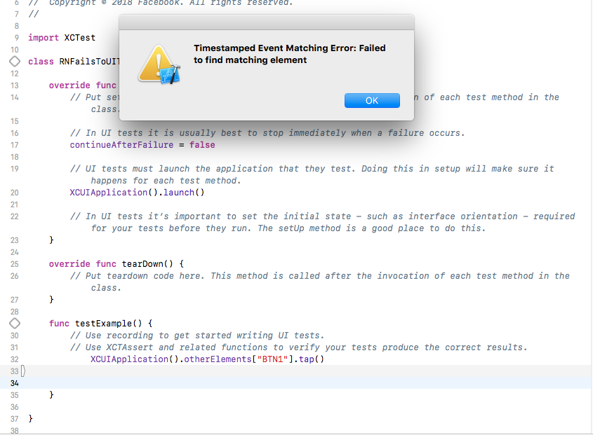

## React Native UI Test Failure replication
This is a simple demo project to show how the xCode Automated UI Test fails when using React native. 

### Boilerplate
The application has been created using `react-native init`. 
After that, its just been added a few buttons to `App.js`. Nothing more. 

### Install
1) Run `Yarn install` or `Npm Install`
- Run `react-native run-ios` if you want to test that the application is working. 

### Reproduce: 
1) Open ios/RNFailsToUITest.xcodeproj
2) Open `RNFailsToUITestUITests\RNFailsToUITestUITests.swift`
3) Put the cursor in `testExample()` and press "Record" on the bottom of the interface. 
4) Wait for Simulator to launch and try clicking around. 

Error: 
